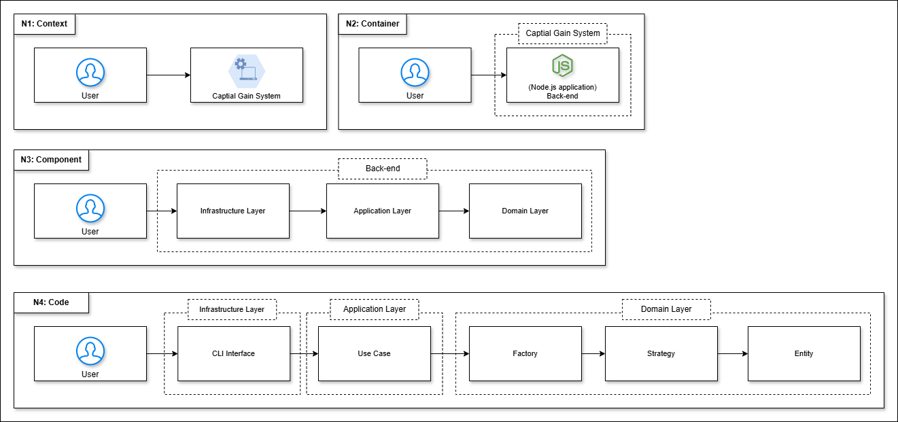
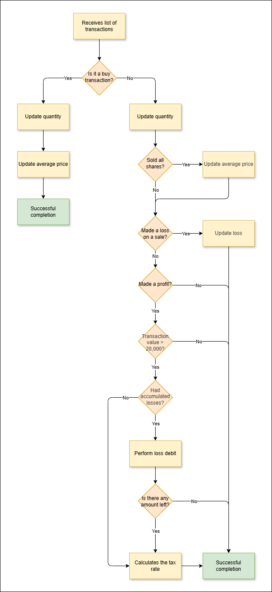

# Code Challenge: Ganho de Capital


Command line application (CLI) that calculates the tax
payable on profits or losses from stock market transactions using Clean Architecture and DDD concepts.

---

## Table of contents

* [Usage documentation](#table-of-contents)
    * [Envs](#envs)
    * [Usage with Docker](#table-of-contents)
        * [Prerequisites](#docker-prerequisites)
        * [Usage](#docker-usage)
    * [Usage with Node.JS](#table-of-contents)
        * [Prerequisites](#node-prerequisites)
        * [Installation](#node-installation)
        * [Usage](#node-usage)
        * [Tests](#tests)
* [Architecture documentation](#table-of-contents)
    * [Diagrams](#diagrams)
    * [Folder Structure](#folder-structure)

---

### Envs

The only environment variable is LOG_LEVEL, which indicates the level at which the application should log: DEBUG, INFO, or ERROR. If no value is specified, the application will use the INFO level.

([Back to Table of contents](#table-of-contents))

---

## Docker Prerequisites

To run this project with docker, ensure that you have the following items:

* [Docker](https://www.docker.com/)
* (Optional) [Configured .env file](#envs)

([Back to Table of contents](#table-of-contents))

---

## Docker Usage

1. Build the project

```shell
docker build -t code-challenge .
```

2. After building the project, you can start the application in two ways:

    1. Passing the input parameters when starting the application

    ```shell
    echo '[{"operation":"buy", "unit-cost":10.00, "quantity": 100},{"operation":"sell", "unit-cost":15.00, "quantity": 50},{"operation":"sell", "unit-cost":15.00, "quantity": 50}]' | docker run -i code-challenge
    ```
    OR

    2. Passing the parameters inside the container

    ```shell
    docker run -it code-challenge /bin/sh
    ```

    ```shell
    npm start
    ```

    ```shell
    [{"operation":"buy", "unit-cost":10.00, "quantity": 100},{"operation":"sell", "unit-cost":15.00, "quantity": 50},{"operation":"sell", "unit-cost":15.00, "quantity": 50}]
    ```

([Back to Table of contents](#table-of-contents))

---

## Node Prerequisites

To run this project, ensure that you have the following items:

* [Node.JS](https://nodejs.org) (v22.18.0)
* (Optional) [Configured .env file](#envs)

([Back to Table of contents](#table-of-contents))

---

## Node Installation

1. Open a terminal and navigate to the project's root directory.
2. Run the following command to install the project dependencies:

```shell
npm install
```

3. Run the following command to build the application:

```shell
npm run build
```

([Back to Table of contents](#table-of-contents))

---

## Node Usage

Start the application with the following command:

```shell
npm start
```

([Back to Table of contents](#table-of-contents))

---

## Tests

* Run the following command to execute all tests in the project:

    ```shell
    npm test
    ```

* Run the following command to execute only the unit tests:

    ```shell
    npm run test:unit
    ```

* Run the following command to execute only the integration tests:

    ```shell
    npm run test:integration
    ```

* Run the following command to obtain information about code coverage:

    ```shell
    npm run test:coverage
    ```

([Back to Table of contents](#table-of-contents))

---

## Diagrams

### Architecture - C4 Model



---

### Use Cases Flows

* Process Portfolio



[Back to Table of contents](#table-of-contents)

---

## Folder Structure

* `docs`: All documentation related to the project.
* `src`
  * `application`: Application layer. All use cases and implementations of how the domain should be handled should be here.
  * `domain`: Domain layer. All business rules must be here.
  * `infrastructure`: Infrastructure layer. All input/output dependencies should be here.
* `tests`: Project tests, replicating the source folder structure, only dividing between integration and unit files.

([Back to Table of contents](#table-of-contents))
